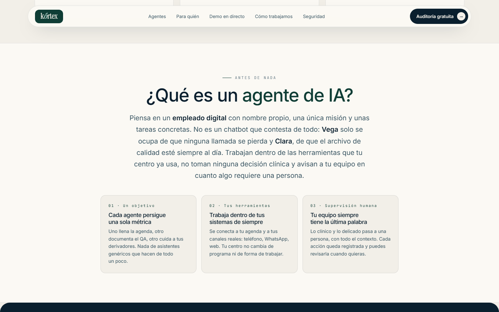
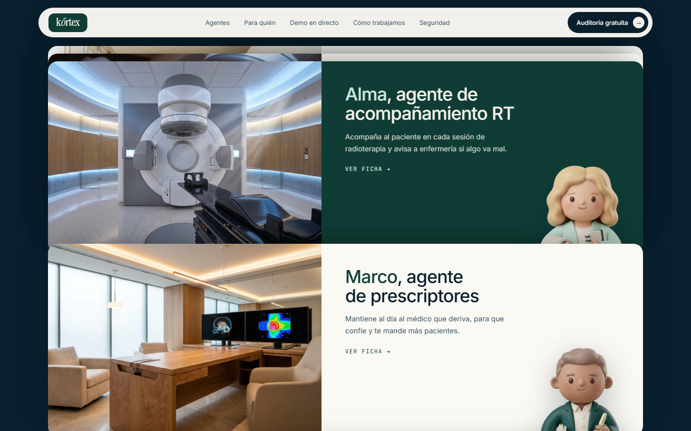
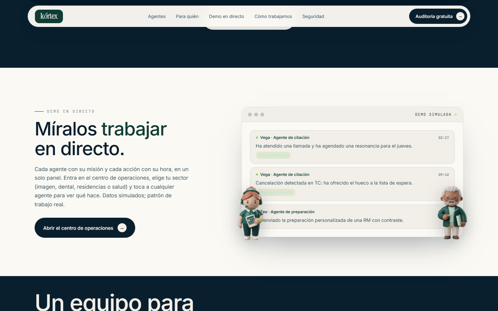
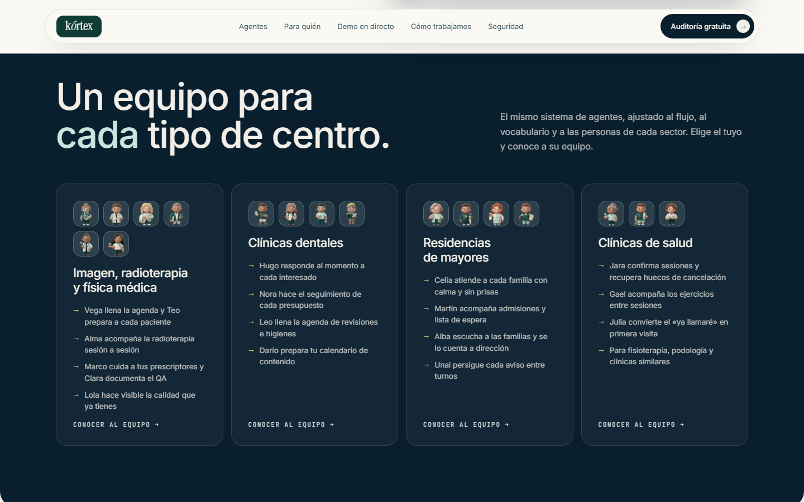
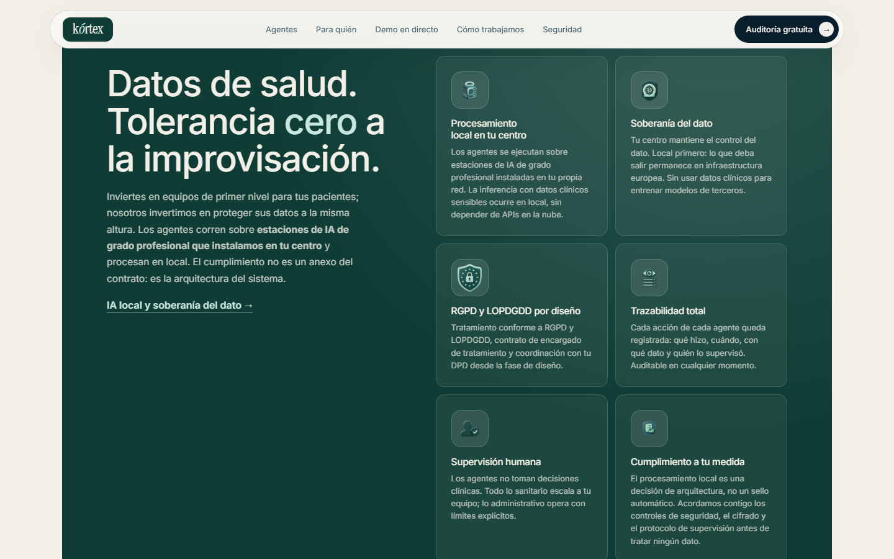
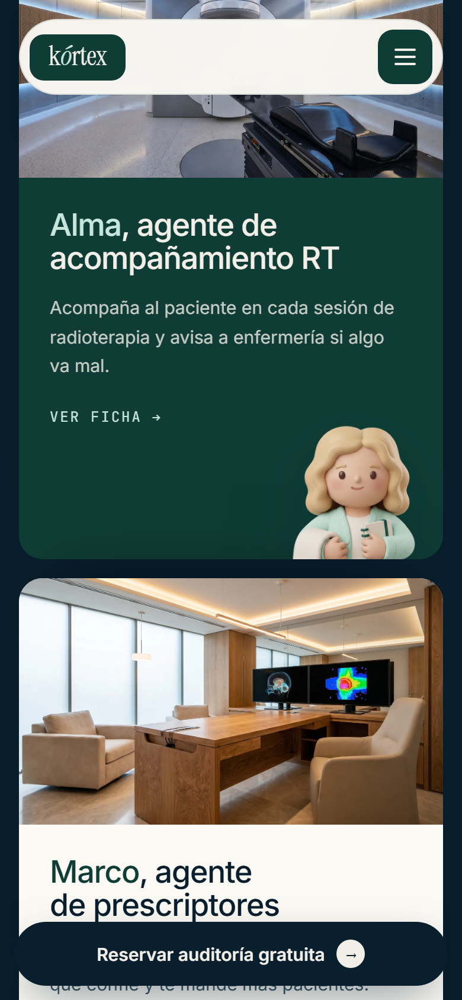

# Kórtex Agents — website

**Live: [www.kortexagents.com](https://www.kortexagents.com)**

Marketing site for **Kórtex**, an engineering studio that deploys teams of named AI agents for the Spanish healthcare sector: diagnostic imaging, radiotherapy and medical physics as the flagship vertical, plus dental clinics, senior residences and health clinics.

Every agent has a name, a single mission and a 3D matte-clay mascot (Vega, Teo, Alma, Marco, Clara, Lola and up to 18 specialists across verticals). The site is built around that cast: mascots are not decoration, they are the product's face, integrated into cards, heroes and an animated operations scene. Human oversight is part of the value proposition and part of the copy.

This repository contains the **landing page**. The rest of the site (agent profile pages, the interactive operations center with its animated clinic scene, per-vertical pages) ships from a private repo and will be published here piece by piece as it evolves.

* * *

## Screenshots

| | |
|---|---|
|  |  |
| Cinematic hero, real clinical setting | Plain-Spanish explainer for non-technical buyers |
|  |  |
| Sticky stacked cards, mascot peeking from the edge | Teaser of the live operations console |
|  |  |
| One team per type of clinic | Data protection as a first-class section |

* * *

## Stack

| Layer | Choice |
|---|---|
| Markup | Hand-written `HTML5`, one file per page, no framework, no build step |
| Styling | Single `CSS` design system on custom properties (clinical palette: teal, mint, bone, lime) |
| Interactivity | Vanilla `JS`, no dependencies |
| Type | `Instrument Serif` + `Inter` + `JetBrains Mono` |
| Images | `WebP` everywhere, `srcset` per density, LCP preloaded with `fetchpriority` |
| Forms | `FormSubmit` (recipient replaced by a placeholder in this repo) |
| Hosting | Static on LiteSpeed; canonical redirects and security headers via `.htaccess` in production |

* * *

## Architecture

**Design system.** All tokens live in `:root` custom properties: palette, radii, shadows, type scale. Components read tokens, never hardcode values, which keeps 15+ production pages visually coherent from one stylesheet.

**Mascot integration.** Each agent card anchors its 3D mascot peeking over the card edge: absolutely positioned transparent `WebP` inside an `overflow:hidden` card, with reserved text padding so copy never collides. No clip-paths, no masks; the cheapest technique that reads as premium.

**Sticky stacked cards.** The six agent cards stack with `position:sticky` and a per-card `--i` custom property that staggers offsets and animation delays from a single rule.

**SEO and GEO.** JSON-LD `@graph` (Organization, ProfessionalService with a service catalog, WebSite, BreadcrumbList), canonical and hreflang, an image-extended sitemap, and answer-engine readiness: `robots.txt` explicitly welcomes AI crawlers and production serves an `llms.txt`.

* * *

## Lead capture, handled like untrusted input

- Honeypot field (`_honey`) kept off-screen for bots.
- Recipient address is not exposed in this repository (placeholder `TU_ALIAS_DE_FORMSUBMIT`).
- Production CSP restricts `form-action` to `'self'` and the form processor only.
- No cookies, no trackers, no third-party analytics on the page.

* * *

## Security

Production serves a strict `Content-Security-Policy` (default `'self'`, no inline scripts), `Strict-Transport-Security` with preload, `X-Content-Type-Options`, `X-Frame-Options: DENY`, `Referrer-Policy` and a restrictive `Permissions-Policy`. Canonical host and HTTPS are enforced at the edge.

* * *

## Performance and accessibility

- 100/100 desktop performance on the host's speed test at launch.
- Every animation respects `prefers-reduced-motion`.
- Skip link, labelled navigation, `aria-pressed` state on toggles, decorative images with empty `alt`.
- Total landing payload dominated by optimized `WebP`; hero preloaded, everything else lazy.

* * *

Built by [Daniel Brosed](https://github.com/vaultbit-web) · Kórtex. All rights reserved: brand, mascots and copy are not licensed for reuse.
